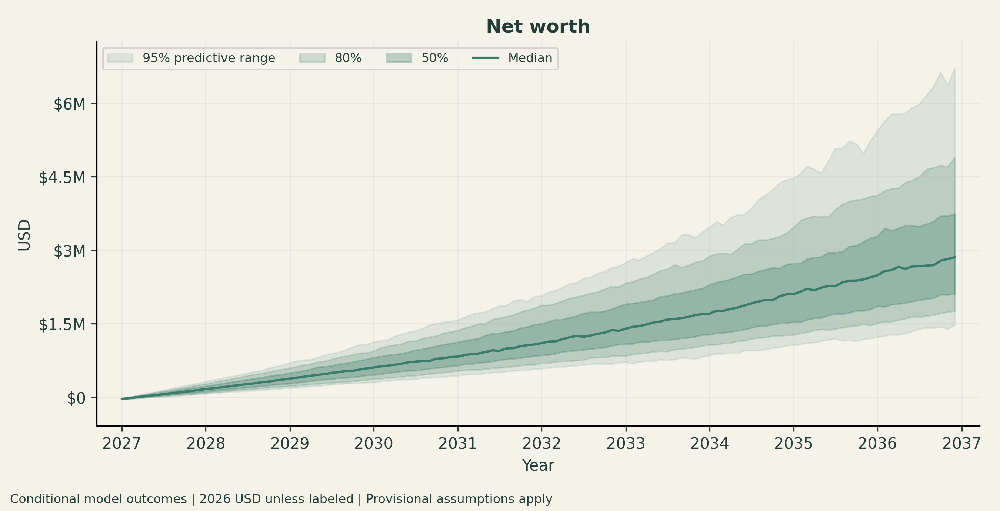
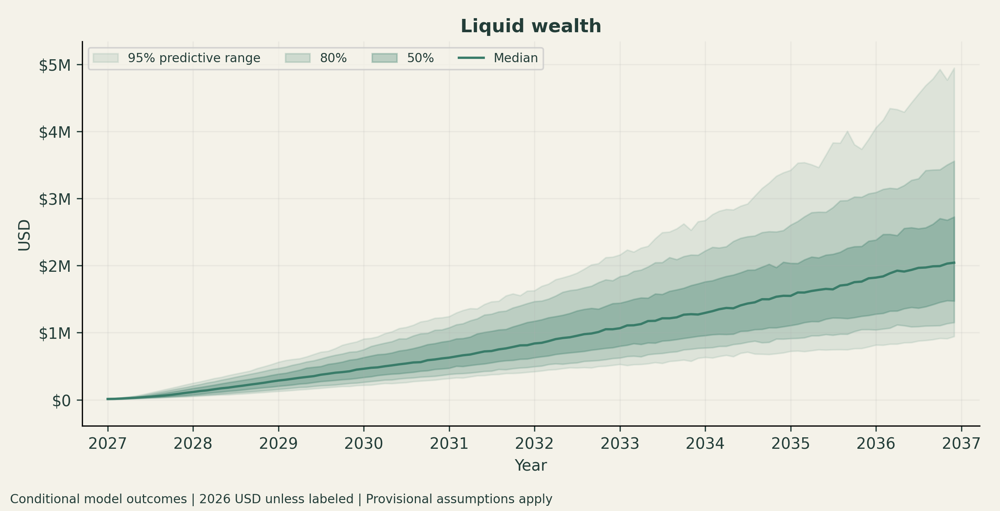
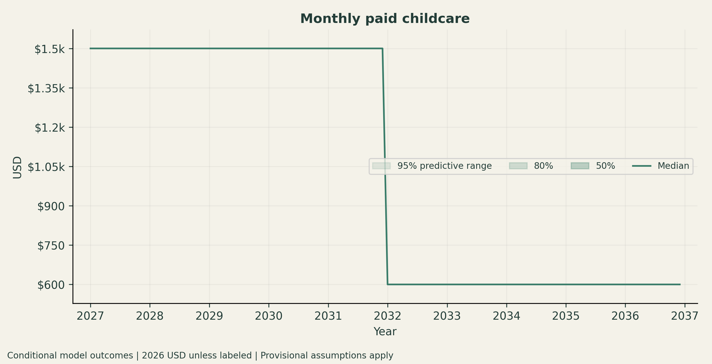
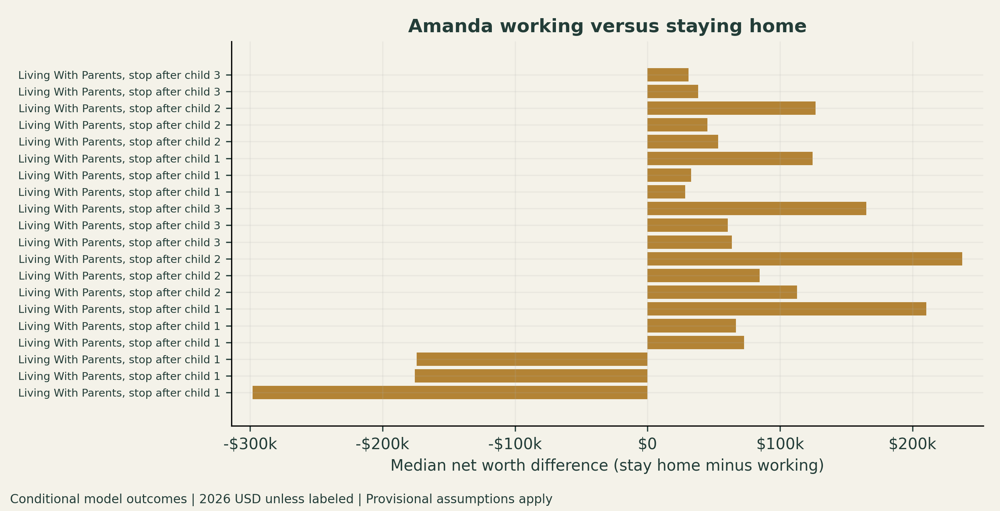
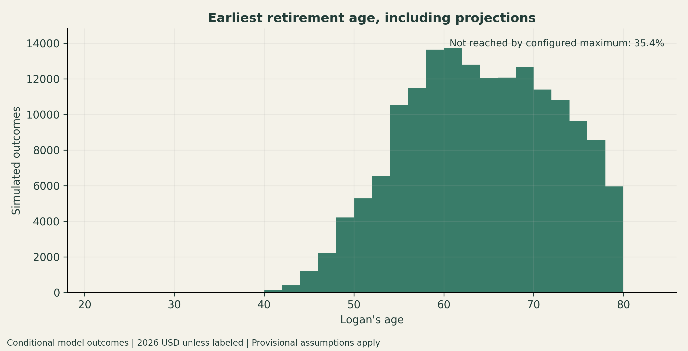
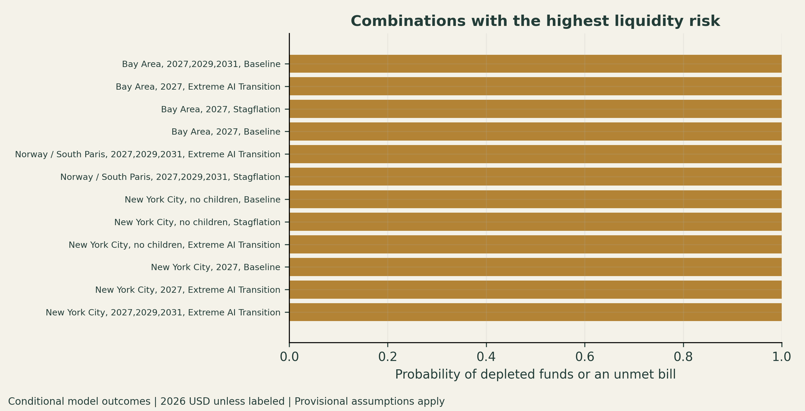
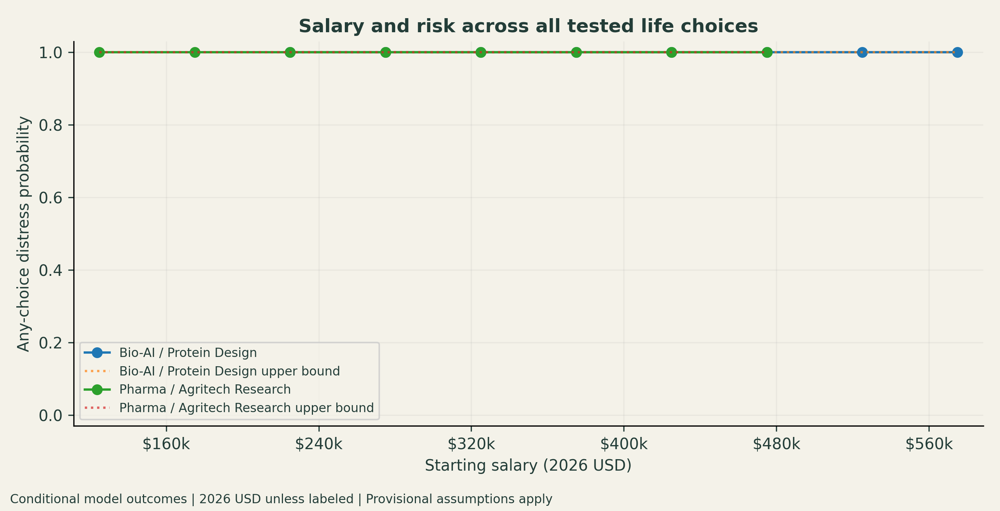

# Household and Synthyra finance simulator

A monthly household and founder-finance simulator for October 2026 through December 2036. The first three months bridge the September starting balances. Every stochastic path also gets an earliest retirement-age estimate, with a separately labeled projection beyond 2036.

This is a conditional planning model. Regional costs, business outcomes and several tax treatments remain assumptions. [MODEL.md](MODEL.md) describes the calculations and their limits. The obsolete retirement app and contextual `synthyra/` and `previous/` folders have been replaced by the integrated model and a private local `PROJECT_CONTEXT.md`. UD source materials remain local.

<!-- latest-results:start -->
## Latest results

Latest completed report: **`outputs/decision-audited-2026-09-10`** (explicit selection), updated **2026-09-10 22:07 UTC**.

| Scenarios | Paths per scenario | Total paths | Simulation + storage | Reports | Figures |
| ---: | ---: | ---: | ---: | ---: | ---: |
| 5,742 | 256 | 1,469,952 | 499.7 s | 58.2 s | 27 |

Conditional simulation results with provisional assumptions, not a probability-weighted forecast. Trajectory bands are marginal percentiles; company charts use one actual path. Figures can cover different scenario subsets, described in their captions.

[View every figure](docs/results/latest/README.md) · [Run metadata](docs/results/latest/summary.json) · [Model limitations](MODEL.md)

| Net worth | Liquid wealth |
| --- | --- |
|  |  |

| Childcare | Amanda work comparison |
| --- | --- |
|  |  |

| Minimum retirement age | Depletion combinations |
| --- | --- |
|  |  |

| Salary risk frontier |
| --- |
|  |

This section and the versioned gallery refresh after successful CLI report runs. Commit and push `README.md` and `docs/results/latest/` to display the new results on GitHub. Run `python showcase.py` to refresh from existing outputs. Partial runs and runs without completed reports do not replace the gallery.

<!-- latest-results:end -->

## Run

Python 3.11 or later. On a new checkout, create a virtual environment and copy the example configuration once. Keep an existing private `config.py`:

```powershell
python -m venv .venv
.venv\Scripts\Activate.ps1
python -m pip install -r requirements.txt
if (!(Test-Path config.py)) { Copy-Item config.example.py config.py }
python simulate.py --config config.py --preset demo --dry-run
python simulate.py --config config.py --preset demo --output outputs/my-first-run
streamlit run app.py -- --output outputs/my-first-run
```

The example `demo` has 60 scenarios. The current example `standard` grid has 387,000 scenarios and nearly 100 million paths at 256 paths each; run `--dry-run` before committing to that workload. The README gallery can show an explicitly selected catalog and does not imply that the full grid was run.

Streamlit opens the latest completed report by default. To choose a specific run:

```powershell
streamlit run app.py -- --output outputs/my-run
```

New results display monetary outcomes in **2026 dollars**, with each path deflated before its quantiles are calculated. Nominal accounting ledgers remain available for reconciliation. Legacy runs retain explicit nominal labels and are never relabeled as real dollars.

Use **Reset all filters** to restore the complete saved catalog. The run caption identifies its preset or explicit selection and actual location/economy coverage. The app has one main chart with every scenario's median trajectory. Remove options to remove the corresponding lines. Click a point to see its scenario choices, event timeline and retirement outlook. Display names are readable; serialized keys and IDs remain stable.

Choose a 50%, 80% or 95% predictive range. Shading is the envelope of those ranges across selected scenarios, not a pooled probability forecast. The Balanced axis keeps ordinary balances readable beside large exits while retaining negative values. Linear scaling, pan and zoom are also available. Cached column-projected data and WebGL rendering avoid repeated full-result reads.

## Inputs and coverage

Private inputs are in `config.py` and `inputs/household.json`, both ignored by Git. For a fresh checkout, copy `config.example.py` to `config.py` and enter actual balances. Defaults are illustrative. `PROJECT_CONTEXT.md` is also private because it includes personal finances and company details.

The default practical grid now runs **387,000 scenarios with 256 paths each**, or **99,072,000 stochastic paths**. It crosses the named company/career schemas with all eight locations, available housing choices, marriage, birth schedules, every applicable Amanda employment policy, economic narratives, benefit branches, and independent career-change and move years. The latest saved showcase can use a smaller, explicitly configured validation workload; it does not imply completion of these larger defaults. Career and location choices remain independent even when an employer would need to approve remote work; unresolved reference-geography mismatches are flagged. UD nonrenewal is excluded from new defaults. New jobs and moves can begin in **2027, 2029 or 2032**. Known UD/DARPA compensation timing stays February 2027.

Locations are **Bay Area, Pittsburgh (Squirrel Hill), NYC, parents, Newark, Norway/South Paris, Boston/Cambridge, and Philadelphia suburbs**. Older immutable runs may contain previously configured locations.

This practical grid is an explicitly chosen set of base schemas, not an implicit sample of the full Cartesian product. All declared combinations run. The `full` preset exhaustively crosses the larger configured annual grids; its unrestricted defaults contain **82,408,441,737,600 scenarios**, which is not practical on local hardware. Choose an explicit grid before execution. Dry runs show exact coverage. No runtime target silently discards scenarios.

```powershell
python simulate.py --preset demo --paths 256 --output outputs/demo
python simulate.py --preset full --dry-run
python simulate.py --preset full --career ud_blend --location squirrel_hill --dry-run
```

`baseline` has one scenario, `family` has 20, and `demo` has 60. `--maximum-batches 2` explicitly pauses after two batches and marks the run partial. Resume with identical inputs and engine:

```powershell
python simulate.py --config config.py --output outputs/my-run --resume
```

Completed results cannot be overwritten. Edited assumptions require a new output folder. Partial runs show their saved coverage in the app.

## Edit assumptions

```python
CONFIG.household.amanda.salary = 65_000
CONFIG.household.family_medical_monthly = 700
CONFIG.paths = 1024
CONFIG.location_overrides['squirrel_hill'] = {'rent': 2500, 'home_price': 550_000}
CONFIG.grid.practical_transition_years = (2027, 2029, 2032)
CONFIG.grid.practical_birth_schedules = ((), (2029,), (2029, 2031))
CONFIG.grid.base_schemas['norway_licensing'] = {
    'location': 'norway', 'housing': 'buy', 'company_outcome': 'licensing',
}
CONFIG.retirement.annual_spending_override = 70_000  # Total household budget, October 2026 dollars.
CONFIG.retirement.success_target = .95
CONFIG.retirement.life_expectancy = 100
CONFIG.retirement.maximum_retirement_age = 80
```

`stop_after_birth=0` means Amanda continues working; 1, 2 or 3 stops her at that birth. Paid childcare then becomes zero for every child. Employment income and new retirement contributions stop, existing assets remain invested, and family or replacement coverage is priced. A stop policy whose birth never occurs remains inactive.

Duplicate grid values, misspelled base-schema keys and unknown grant references are rejected before simulation. Named dataclasses define settings in [configuration.py](finance_sim/configuration.py). States use postal strings and careers/locations use string keys. Dense arrays remain private to compiled CPU calculations. For precise reruns, pass `selected=[Scenario(...)]` to `finance_sim.workflow.execute` or use the CLI selection flags.

## Salary and life-choice analysis

Bio-AI engineering, research and protein-design roles share one visual option, covering the Biohub/Profluent/Cradle-style landscape. Pharma and agritech PI/director roles share another. Starting salary is drawn once per path and retained across comparable scenarios:

| Landscape | Minimum | Most likely | Maximum |
| --- | ---: | ---: | ---: |
| Bio-AI / protein design | $200,000 | $250,000 | $600,000 |
| Pharma / agritech PI and director | $100,000 | $300,000 | $500,000 |

These triangular distributions are editable planning assumptions supplied by the user, with modeled peaks, not measured market frequencies. Figures are 2026-dollar annual starting compensation. Employee raises occur on annual role anniversaries, with economic wage shocks accumulated between reviews. Company compensation also has annual raises. Living, family, healthcare, moving, wedding and company operating costs inflate; signed grant caps, debt principal and contractual exit amounts remain nominal contractual inputs.

Every report automatically saves:

- `decision_analysis.md`: written findings and highest-risk life-choice combinations.

- `depletion_combinations.csv`: cash-zero, liquid-depletion and net-worth-reversal probabilities, with uncertainty and event timing.

- `salary_risk_frontier.csv`: $50k salary bands by career landscape, location and economic narrative, plus all-tested-choice screens.

The default risk budget is 5%. For each independent economic path the analysis asks whether **any** tested combination runs out of liquid funds or leaves bills unpaid. Reusing that path across scenarios does not increase its sample size. Simultaneous 95% upper bounds account for the many reported salary cells. A supported salary threshold requires enough paths and every higher tested band to pass. Empty tails, adverse combinations or failure before the new job can prevent a threshold. This is a conditional liquidity screen, not a guarantee that all life choices work or a calibrated probability forecast.

The Streamlit **What worked and failed in the saved runs?** section analyzes existing results directly, with aggregate trends instead of individual failure examples. Its trends follow current chart filters. The separate salary-goal analysis holds salary fixed across matched life choices. Coincidence with a birth, move or employment stop is not treated as proof of causation.

For higher precision, increase `CONFIG.paths`, restrict the configured question explicitly, or use `CONFIG.career_salary_overrides` for an exact salary rerun. Existing outputs stay immutable.

## Retirement readiness

[RetirementPolicy](finance_sim/configuration.py) replaces the old standalone retirement app. Each path checks annual candidate retirement ages using accessible investments, retirement accounts after a provisional tax reserve, retirement spending, longevity and stochastic returns. Home equity and unsold company interests do not count as retirement funding.

The default target is 95% modeled lifetime funding success through the younger adult's age 100. A separate bridge checks accessible money before retirement-account access age. The updated lifecycle budget ends ordinary child support at 18, pays half of public in-state college costs through age 21, and ends support at 22. Mortgages amortize over their actual 20-30 year configured term; rent, property taxes, insurance and maintenance continue as applicable. Released expenses increase future savings. Finite obligations are reserved separately from the ongoing retirement portfolio budget. Beyond 2036 this remains a conditional projection, not fully simulated future careers or tax returns.

Saved fields include `minimum_retirement_age`, `retirement_age_source`, real spending/capital requirements, and scenario retirement-age quantiles. Unreached paths remain in quantiles as censored outcomes; a missing median means the target was not reached for enough paths by the configured maximum age. See [the full retirement methodology](MODEL.md#retirement-readiness).

## Saved outputs and GitHub showcase

Each run saves:

- A versioned manifest, resolved inputs, source metadata and engine source archive.

- Committed Parquet summary, terminal-path and monthly predictive-band partitions.

- Selected actual monthly ledgers, CSV summaries and a formatted Excel report.

- **27 figure types**, saved as 300-dpi PNGs, with coverage and interpretation records.

All terminal stochastic paths are retained. CSV summaries and decision analysis retain all reported scenarios. Excel sheets show at most 10,000 rows and distribution figures use at most 1,000 evenly spaced scenarios; `report_scope.json` records that selection. The app's overview includes every saved scenario without sampling. Neither descriptive mixtures nor range envelopes assign scenario probabilities.

After successful report generation, `simulate.py` automatically refreshes this README and `docs/results/latest/` from the most recent completed report. Only figure PNGs and a small aggregate summary are copied. Raw workbooks, account inputs and ledgers remain ignored. Use `--no-showcase` to skip the refresh or `python showcase.py` to refresh manually.

GitHub displays these relative image links after the README and gallery assets are committed and pushed. Running locally does not publish or push them automatically.

## Calibration and uncertainty

The private configuration uses 12-month block resampling of 115 aligned historical observations: S&P 500 prices plus a dividend proxy, CPI, national house prices and a Treasury cash-rate proxy. Missing months are not interpolated. These observations do not establish local house prices or provide a complete range of future economic regimes. Refresh intentionally into a new folder:

```powershell
python calibrate.py --output data/calibration-new
```

`return_mode='parametric'` uses editable return/volatility assumptions. Structural recession, inflation and AI narratives are separate conditional inputs. The optional probability forecast samples declared subjective career/macro priors and grant outcomes, conditional on its stated family, housing and company choices:

```powershell
python forecast.py --config outputs/my-run/config.json --output outputs/my-run/probability_forecast --paths 4096
```

DARPA's 95% award probability is Logan's judgment. No implicit likelihoods are attached to marriage, children, exits or the practical base schemas. Predictive ranges and Monte Carlo sampling error are distinct; 256 paths leave extreme tails noisy.

## Verification and performance

```powershell
$env:PYTEST_DISABLE_PLUGIN_AUTOLOAD='1'
python -m pytest
python validate_run.py --output outputs/my-run --deep
python benchmark.py --paths 256
```

Tests cover ledger reconciliation, repayment and taxes, family transitions, benefit eligibility, grants, financing, reproducibility/resume, retirement accessibility and censoring, chart filtering and negative-axis limits. The dashboard's ranges and point selection are tested separately from the simulation engine.

Historical reference: the earlier 7,200-scenario run took 357 seconds for simulation/summaries/storage and 24 seconds for figures/Excel, with about 922 MB of outputs. Grid counting now deduplicates base schemas before expanding family combinations; counting the 366,360-case standard grid takes about 0.02 seconds on this machine. A cached 60-scenario demo took about 10 seconds. Those figures precede the retirement extension and expanded transition timing; current run timing appears in the automatic showcase. Compilation adds first-run overhead. No full household GPU implementation or CPU/GPU parity is claimed.

## Salary-only family and retirement test

```powershell
python salary_support.py --config config.py --dry-run
python salary_support.py --config config.py --output outputs/salary-support-age60 --paths 256
# Only DARPA supports Synthyra pay; switch to outside employment when it ends:
python salary_support.py --config config.py --company-support darpa_only --output outputs/salary-support-darpa-only-age60 --paths 256
# Resume an interrupted salary checkpoint with identical inputs and engine:
python salary_support.py --config config.py --output outputs/salary-support-age60 --paths 256 --resume
```

Streamlit automatically discovers this separate analysis under `outputs/` and shows it beneath the all-simulations chart. Main chart filters do not change its declared coverage. The new section answers whether employment salary alone can support Amanda leaving work, the configured family choices, all configured locations and every configured economic narrative. It recomputes the household with **zero Synthyra pay, distributions and liquidity proceeds**, and verifies every personal company-income channel is zero. It does not subtract company proceeds from a previously taxed result.

The **Salary goal without a Synthyra windfall** selector distinguishes two downside cases. `none` assumes no personal company income. `darpa_only` keeps the $31,500 UD / $82,500 Synthyra annual split, with modeled raises, during the February 2027 through January 2029 award period. Outside employment begins in February 2029. The award is conditional on success and reimburses eligible actual costs up to its budget; the $2 million ceiling is not personal income or a guaranteed lump-sum receipt. Commercial revenue, follow-on contracts, distributions and exits are disabled. The founder receives no pay outside the award period. Normal benefits and job-disruption assumptions apply to outside employment, and retained UD benefits are assumed during the split. Salary start dates are shown explicitly, so these are alternative career timelines, not an isolated causal estimate of receiving the grant.

Existing saved runs remain useful for descriptive trends. Controlled reruns add coverage for fixed salaries and explicit company downside cases that those runs did not contain. They do not replace the existing-run analysis.

Success requires every bill paid and no depleted liquid wealth throughout 2027–2036; a six-month essential-spending reserve after Amanda stops; and retirement readiness together by **Logan age 60**. Three requirement buttons select retirement, paid bills, and the six-month reserve. The retirement-age selector compares age 60 with 65 using the saved paths. The salary threshold and both charts recompute for the selected combination from retained results, without rerunning simulations. All three are selected initially. Retirement still uses the existing 95% lifetime-funding target through the younger adult's age 100, with an explicitly conditional projection beyond 2036. This inner funding target is separate from the 95% outer probability of meeting the three support conditions.

The default focused test crosses 1,548 life configurations with 13 fixed starting salaries from $100k to $1m in 2026 purchasing power. Salary begins in January 2027, marriage occurs in 2028, moves can occur in 2027/2029/2032, and the current configured birth schedules are 2029; 2029/2031; and 2029/2031/2033. Amanda stops at each applicable birth. All eight configured locations, both renting/buying where applicable and all six macro scenarios are tested. This is not a test of every annual birth schedule or every marital arrangement. The coverage appears in the app, and all settings are saved with the analysis.

Edit `CONFIG.salary_support.salaries`, `.salary_start_year`, `.marriage_year`, `.retirement_age`, and `.reserve_months`. Location, economic, move and birth choices come from `CONFIG.grid`; the same exact configured combinations are enumerated at every tested salary. Salary values above the normal role ranges are stress-test hypotheses, not predicted job offers. Industry employee benefits and job disruptions remain modeled assumptions.

The six-month reserve uses cash plus taxable investments less tax liabilities and unpaid obligations, excluding retirement accounts and home/company equity. It is not a cash-only reserve. Essential spending is the trailing twelve-month average in 2026 dollars (or the available bridge/history before twelve months), including required debt and mortgage payments and excluding discretionary saving and extra debt payments. Retained investments continue facing market risk. Reserves are checked when Amanda is home; bills and depletion are checked over the whole horizon, including earlier months.

A salary passes only if the simultaneous 95% Monte Carlo lower confidence bound meets the 95% support target at that salary and every higher tested salary. No untested salary is interpolated. One economic path remains one trial after taking the worst outcome across choices. Location, children, macro, housing and timing charts identify trends and the requirement that most often fails. Generic risk trends on the main saved run are descriptive equal-configuration averages, with configuration variation clearly separated from Monte Carlo uncertainty.

Checkpoints retain group-wise worst retirement ages, minimum liquidity/reserve margins and unioned failure flags for each paired path. Per-configuration statistics are saved alongside them, and the config and engine are archived. Partial analyses display progress and withhold thresholds; completed folders cannot be overwritten. This keeps the interactive app fast and keeps the salary-only analysis separate from completed main simulation outputs.


## Audit and result integrity

[Read the September 10 review, repairs and remaining limits](AUDIT.md).

`python validate_run.py --output outputs/my-run --deep` checks every committed partition hash, scenario/path coverage, duplicate identifiers, summary medians and monthly quantile ordering. It is read-only, works with partial runs, and exits with an error when stored evidence is inconsistent. Salary-support folders use the same command. Integrity checks do not establish that model assumptions are calibrated.

`--resume` can retry interrupted report generation without repeating completed simulations, using identical inputs and engine code. Reports already completed remain unchanged. Changing the engine requires a new output folder; the archived engine is retained for old runs.

Use retirement model `lifecycle_v3` or newer. Earlier runs omitted changes in unpaid bills and tax liabilities when inferring future saving capacity and may overstate retirement readiness. The dashboard labels those results. The updated engine also keeps restricted grant advances separate by project.

The salary CSV download retains the selected requirements, retirement age, run identity and completion status. Main-chart filters do not affect this separate controlled analysis.
