# Latest simulation figures

Source run: `outputs/decision-validation-2026-09-10`.

Conditional simulation results with provisional assumptions, not a probability-weighted forecast. Trajectory bands are marginal percentiles; company charts use one actual path. Figures can cover different scenario subsets, described in their captions.

[Model definitions and limitations](../../../MODEL.md)

Only report figures and aggregate run metadata are included here. Workbooks, input files and path ledgers remain local.

## Net worth

Predictive bands for scenario 64a2ef6e17963261dfdb; marginal percentiles are not an individual ledger.

## Financial net worth

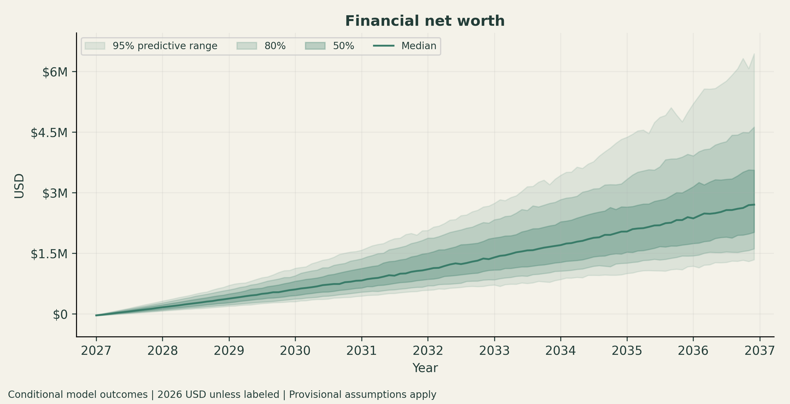

Predictive bands for scenario 64a2ef6e17963261dfdb; marginal percentiles are not an individual ledger.

## Liquid wealth

Predictive bands for scenario 64a2ef6e17963261dfdb; marginal percentiles are not an individual ledger.

## Cash

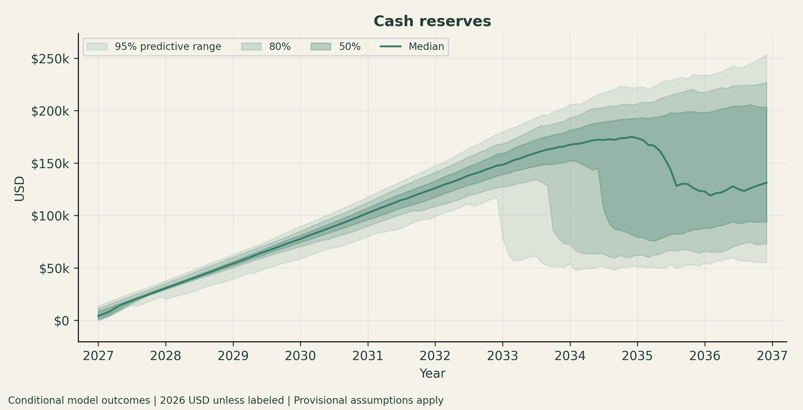

Predictive bands for scenario 64a2ef6e17963261dfdb; marginal percentiles are not an individual ledger.

## Retirement

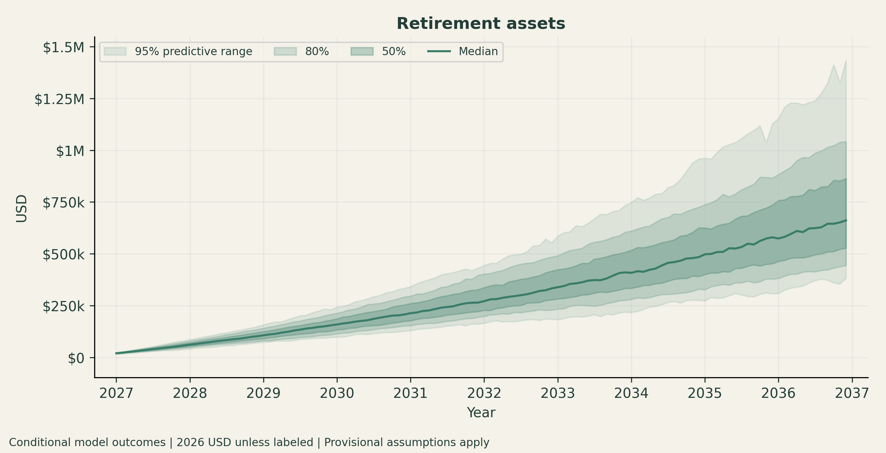

Predictive bands for scenario 64a2ef6e17963261dfdb; marginal percentiles are not an individual ledger.

## Debt

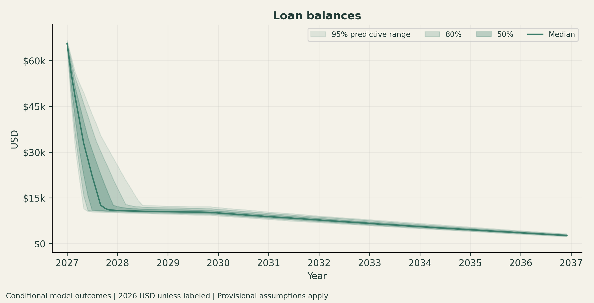

Predictive bands for scenario 64a2ef6e17963261dfdb; marginal percentiles are not an individual ledger.

## Brokerage

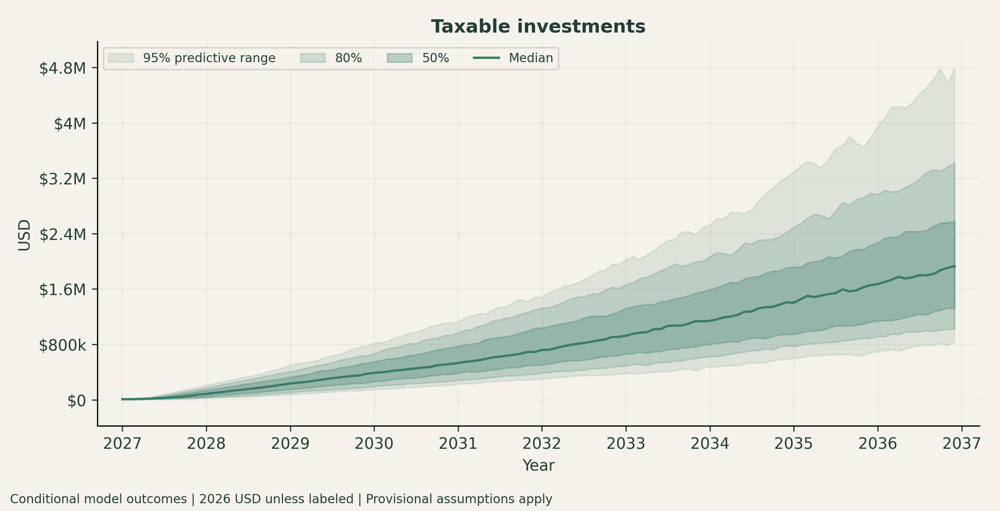

Predictive bands for scenario 64a2ef6e17963261dfdb; marginal percentiles are not an individual ledger.

## Home equity

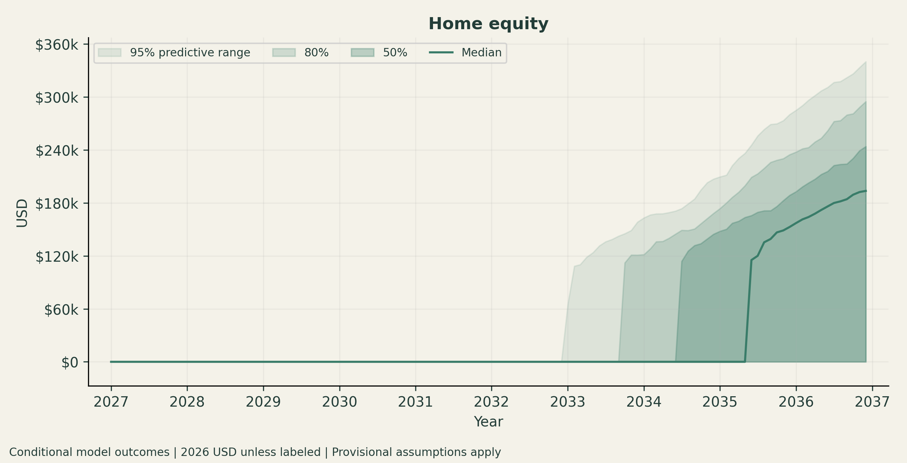

Predictive bands for scenario 64a2ef6e17963261dfdb; marginal percentiles are not an individual ledger.

## Earned income

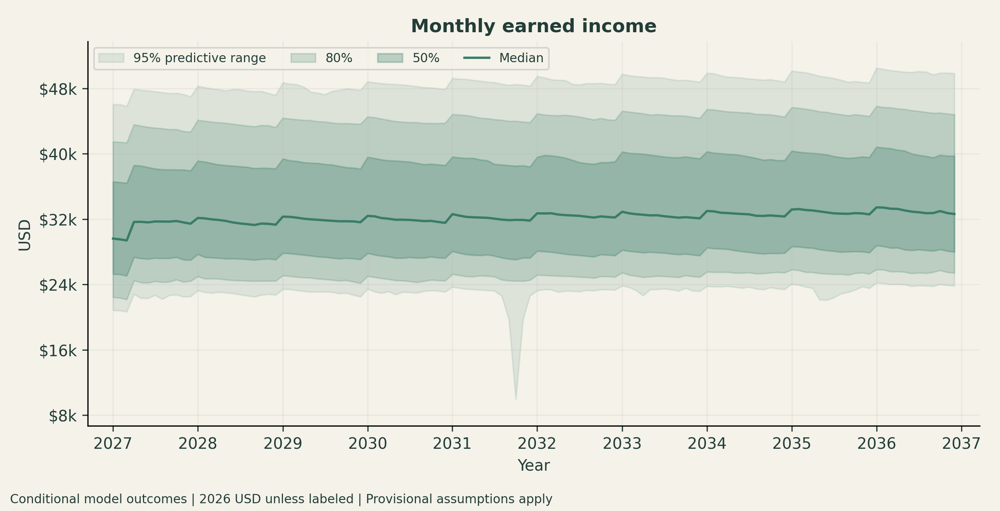

Predictive bands for scenario 64a2ef6e17963261dfdb; marginal percentiles are not an individual ledger.

## Childcare

Predictive bands for scenario 64a2ef6e17963261dfdb; marginal percentiles are not an individual ledger.

## Health premium

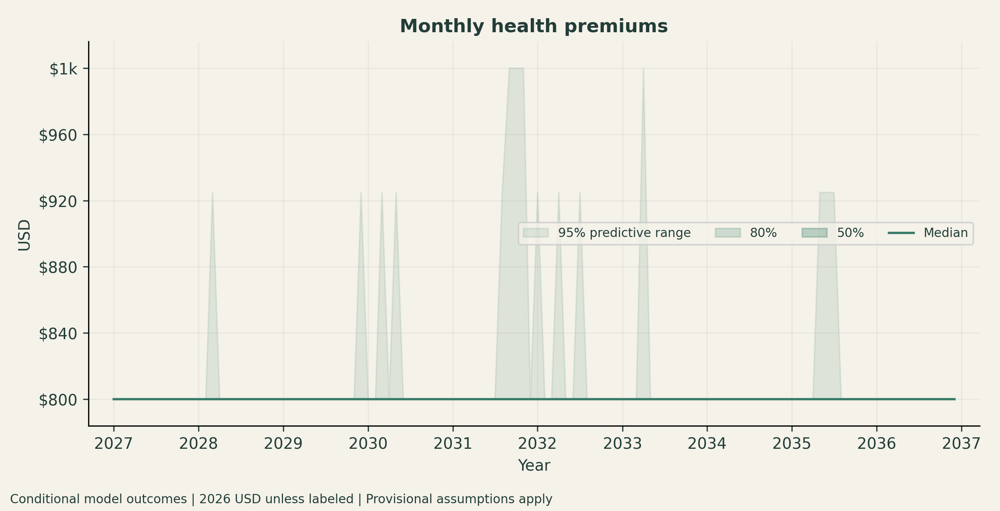

Predictive bands for scenario 64a2ef6e17963261dfdb; marginal percentiles are not an individual ledger.

## Tax expense

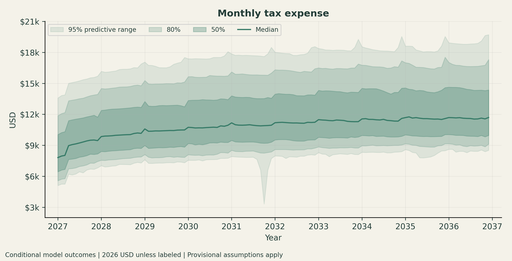

Predictive bands for scenario 64a2ef6e17963261dfdb; marginal percentiles are not an individual ledger.

## Terminal distribution

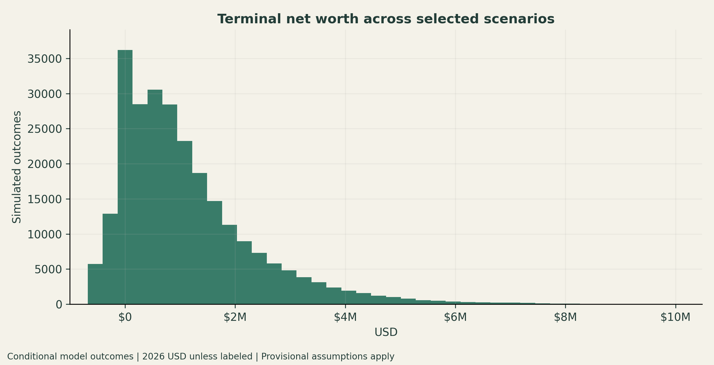

Mixture plots equally weight the selected conditional scenarios; they are not a probability forecast.

## Real wealth cdf

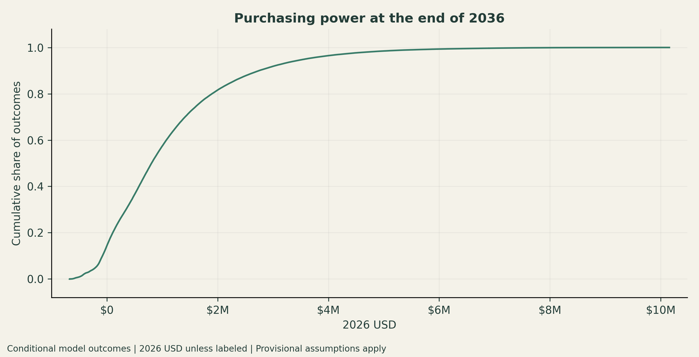

Mixture plots equally weight the selected conditional scenarios; they are not a probability forecast.

## Shortfall probability

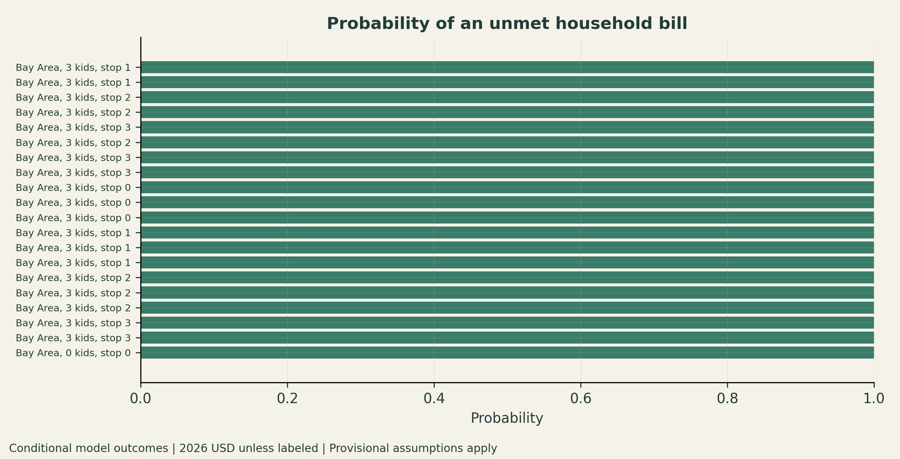

Twenty highest modeled probabilities; exact binomial Monte Carlo intervals are in the summary table.

## Buy probability

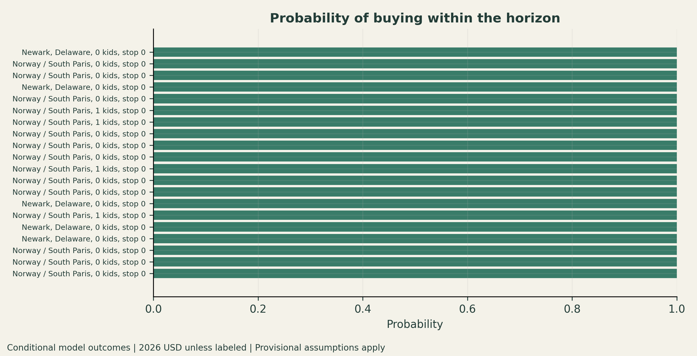

Twenty highest modeled probabilities; exact binomial Monte Carlo intervals are in the summary table.

## Career

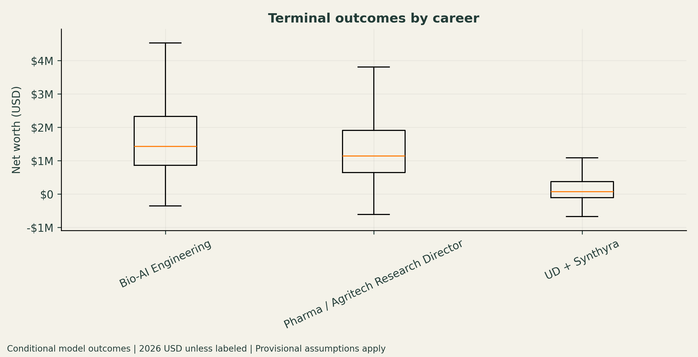

Grouping mixes other scenario assumptions; this is not a causal estimate.

## Location

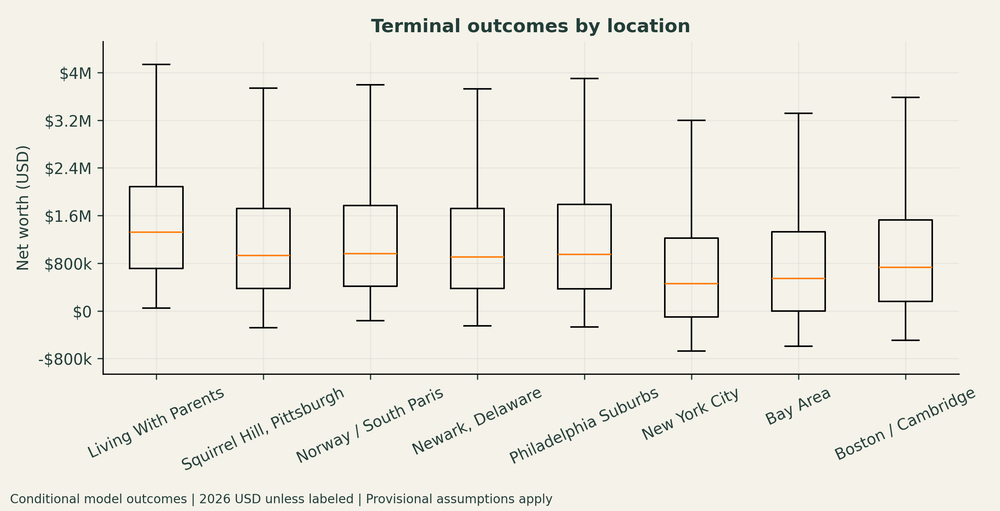

Grouping mixes other scenario assumptions; this is not a causal estimate.

## Amanda work comparison

Matched on all other scenario dimensions; negative values mean lower wealth when staying home.

## Company revenue and funding

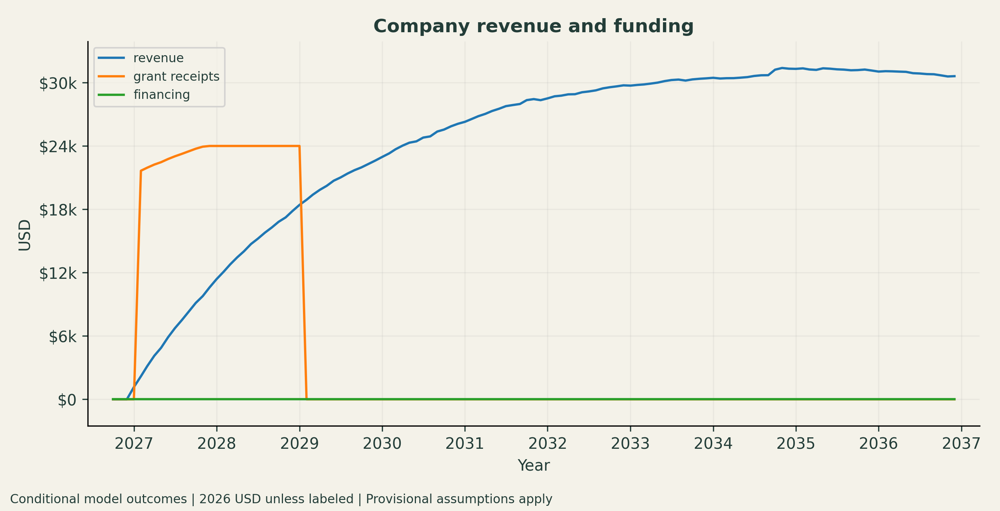

One retained, actual simulated path. This path is not the median of each component.

## Company liquidity and unpaid compensation

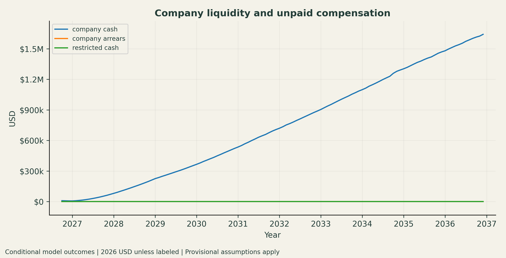

One retained, actual simulated path. This path is not the median of each component.

## Founder ownership through financing

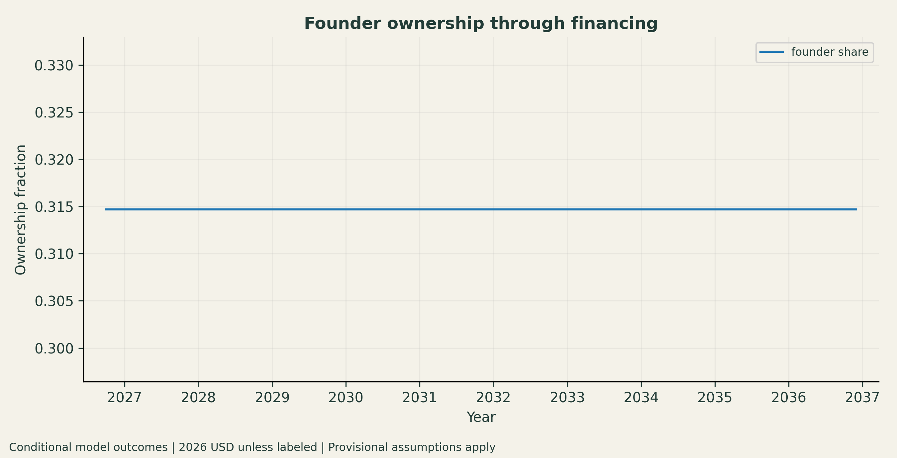

One retained, actual simulated path. This path is not the median of each component.

## Exit proceeds and payment timing

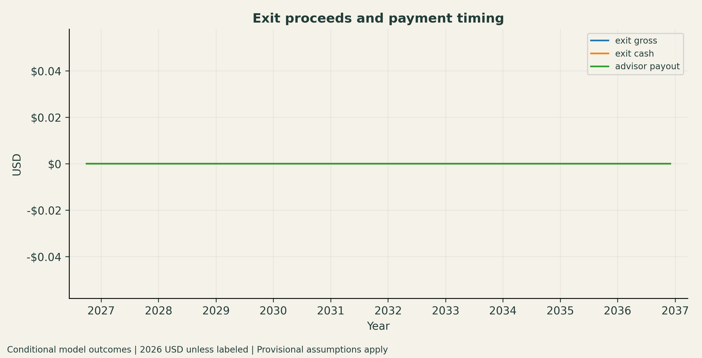

One retained, actual simulated path. This path is not the median of each component.

## Cumulative household income and costs

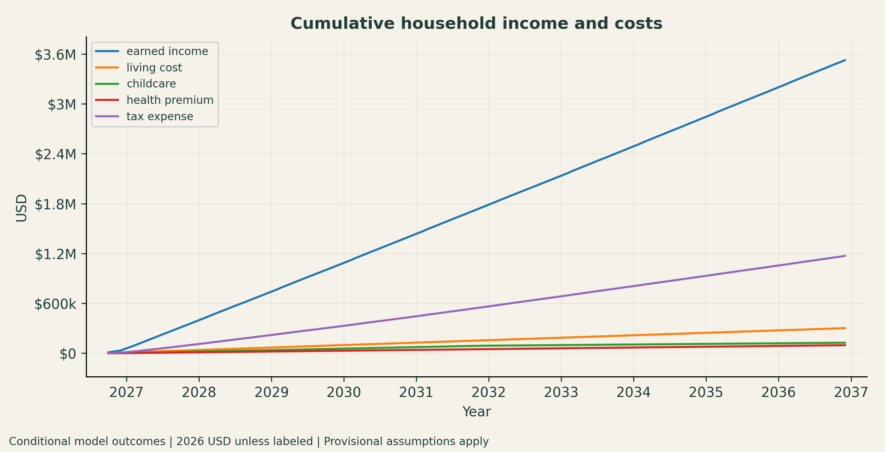

One retained, actual simulated path. This path is not the median of each component.

## Minimum retirement age

Selected conditional paths; beyond-horizon ages are projections. Unreached paths are reported separately, never dropped from scenario retirement-age quantiles.

## Depletion combinations

Highest-risk completed conditional scenarios; full choices and Monte Carlo bounds are in depletion_combinations.csv.

## Salary risk frontier

Each path ORs failure across tested choices/macros. Dotted lines are simultaneous 95% Monte Carlo upper bounds; empty bins remain uncertified.
